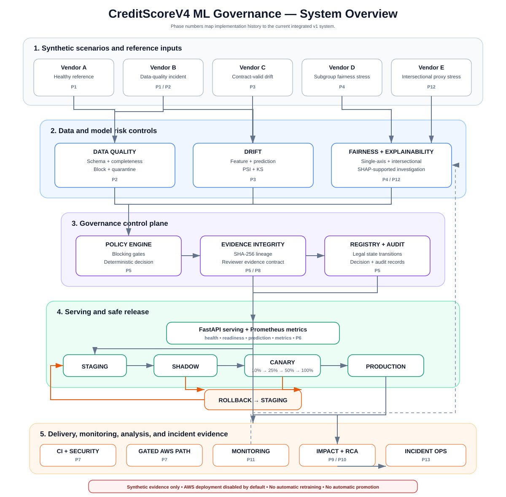
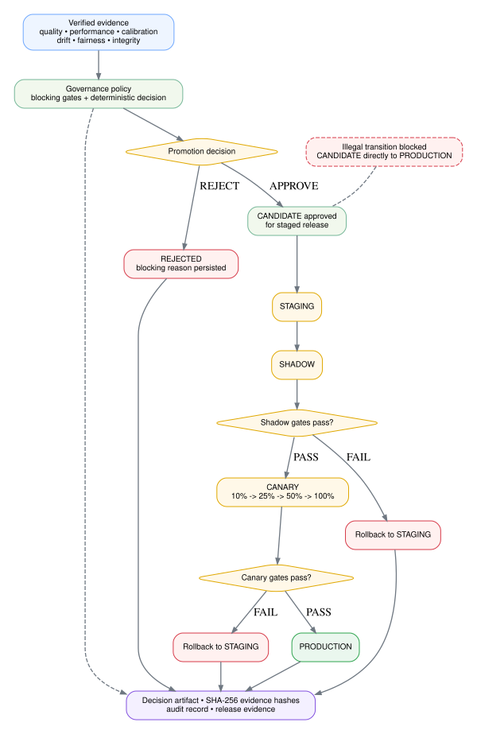
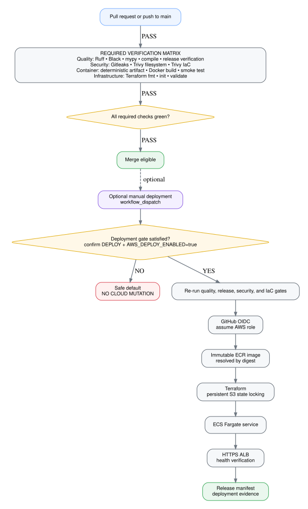

<p align="center">
  <h1 align="center">CreditScoreV4 ML Governance</h1>
  <p align="center">
    Evidence-backed ML governance for data quality, drift, fairness, controlled promotion,
    safe release, monitoring, and incident traceability.
  </p>
</p>

<p align="center">
  <a href="https://github.com/Parmodk2310/CreditScorev4-ML-Governance/actions/workflows/ci.yml">
    
  </a>
  <a href="https://github.com/Parmodk2310/CreditScorev4-ML-Governance/actions/workflows/security.yml">
    
  </a>
  <a href="https://github.com/Parmodk2310/CreditScorev4-ML-Governance/actions/workflows/image.yml">
    
  </a>
  <a href="https://github.com/Parmodk2310/CreditScorev4-ML-Governance/releases/tag/v1.0.0">
    
  </a>
  
</p>

> **A model can be statistically strong and still be unsafe to promote.**
> CreditScoreV4 demonstrates how independent data-quality, drift, fairness,
> evidence-integrity, release-health, and delivery controls can stop unsafe
> progression before production.

CreditScoreV4 is a **deterministic synthetic ML-governance case study**. It uses controlled failure scenarios to exercise an end-to-end ML lifecycle without claiming real applicant data, a real banking incident, regulatory certification, or a live production deployment.

## System overview

The current repository is one integrated ML-governance system. Phase numbers are retained only to map the implemented controls back to their historical milestones.

<p align="center">
  
</p>

<p align="center">
  <sub><a href="docs/assets/diagrams/system-overview.mmd">Mermaid source</a></sub>
</p>

The architecture is organized by control plane rather than by implementation chronology: data/model risk → governance → serving/release → delivery/operations.

## Failure scenarios

| Scenario | Failure mode | Control | Outcome |
|---|---|---|---|
| **Vendor A** | healthy reference | complete governance path | eligible for staged promotion |
| **Vendor B** | `device_risk_score` missingness rises from **3.14%** to **22.00%** | data contract + Great Expectations | **BLOCK + quarantine** |
| **Vendor C** | schema-valid feature and prediction shift | PSI + KS drift governance | **CRITICAL → REJECT** |
| **Vendor D** | aggregate-stable subgroup degradation | fairness + SHAP-supported investigation | **FAIRNESS FAIL → REJECT** |
| **Vendor E** | supported intersection degrades while single axes avoid blocking FAIL | intersectional fairness + proxy-risk screening | **INTERSECTION FAIL** |

These thresholds and scenarios are project engineering guardrails for deterministic synthetic fixtures, not legal or regulatory standards.

## Key evidence

| Evidence | Result |
|---|---:|
| Healthy ROC-AUC | **0.8025** |
| Vendor B ROC-AUC | **0.7329** |
| Vendor B missingness | **22.00%** vs **3.14%** healthy |
| Vendor C prediction PSI / KS | **0.2379 / 0.1863** |
| Vendor D demographic-parity ratio | **0.7480** |
| Vendor E intersection demographic-parity ratio | **0.7479** |
| Vendor B decision flips | **2,500 / 15,000 (16.67%)** |
| Healthy rollout | **10% → 25% → 50% → 100% → PRODUCTION** |
| Degraded rollout | **rollback to STAGING** |
| Phase 13 root-cause completion | **690 min / 2,880 min project SLA** |

## Governance and release model

A candidate is not promoted because one metric looks healthy. Promotion requires verified evidence across data quality, model performance and calibration, drift, fairness, evidence integrity, and legal registry transitions.

<p align="center">
  
</p>

<p align="center">
  <sub><a href="docs/assets/diagrams/governance-release-model.mmd">Mermaid source</a></sub>
</p>

A direct `CANDIDATE -> PRODUCTION` transition is intentionally illegal. Failed shadow or canary gates return the candidate to `STAGING` with auditable release evidence.

## Serving and observability

The approved model is exposed through FastAPI:

```text
GET  /health
GET  /ready
POST /predict
POST /batch-predict
GET  /model
GET  /metrics
```

The serving layer exposes Prometheus-compatible operational metrics and model metadata.

## Scheduled governance

The monitoring layer executes governance controls as a dependency-ordered, fail-closed task graph. It records task status and attempts, required evidence paths, SHA-256 evidence hashes, a monitoring-run manifest, and a JSONL event log.

Automatic retraining and automatic promotion remain disabled.

## Delivery controls

Pull-request verification and cloud deployment are deliberately separated. Merge checks run automatically; cloud mutation requires a separate manual workflow plus explicit deployment enablement.

<p align="center">
  
</p>

<p align="center">
  <sub><a href="docs/assets/diagrams/delivery-controls.mmd">Mermaid source</a></sub>
</p>

The AWS path uses GitHub OIDC, immutable ECR image digests, persistent Terraform state, ECS/Fargate, and ALB health verification. `AWS_DEPLOY_ENABLED=false` remains the fail-closed default, so an unmet deployment gate performs **no cloud mutation**.

## Verification

The current v1.0.0 release verifies:

| Boundary | Status |
|---|---:|
| Ruff / Black / mypy / compile | **PASS** |
| Full pytest suite | **118 passed** |
| Terraform format + validation | **PASS** |
| Container build + smoke test | **PASS** |
| Gitleaks | **PASS** |
| Trivy filesystem / IaC scan | **PASS** |
| Architecture validation | **PASS** |
| Workflow structure / pinning | **PASS** |

Stable verification interface:

```bash
make quality
make release-verify
make phase7-terraform
python -m pytest -q
```

## Quick start

Requirements:

- Python **3.12**
- `make`
- Terraform for infrastructure validation
- Docker for container smoke testing

```bash
git clone https://github.com/Parmodk2310/CreditScorev4-ML-Governance.git
cd CreditScorev4-ML-Governance

python -m venv .venv
source .venv/bin/activate

python -m pip install --upgrade pip
python -m pip install -e ".[dev]"

make quality
make release-verify
```

Run the API after generating the deterministic model artifact:

```bash
python scripts/verify_phase1.py
python scripts/serve_model.py --host 0.0.0.0 --port 8000
```

## Project structure

```text
.
├── .github/workflows/       # CI, security, monitoring, image, gated deployment
├── configs/                 # versioned control / historical phase contracts
├── contracts/               # data contract
├── data/                    # generated evidence, audit, quarantine, registry, release
├── docker/                  # serving and local observability
├── docs/                    # engineering documentation and architecture assets
├── infra/terraform/         # AWS ECR/ECS/Fargate/ALB infrastructure
├── models/                  # generated model lifecycle locations
├── ops/                     # repository operational policy
├── scripts/                 # verification, analysis, serving, monitoring, release
├── src/creditscore/         # application and governance implementation
└── tests/                   # unit, integration, governance, release, operations
```

## Documentation

- [`ARCHITECTURE.md`](ARCHITECTURE.md) — system design and control boundaries
- [`docs/CASE_STUDY.md`](docs/CASE_STUDY.md) — problem, incidents, decisions, and outcomes
- [`docs/TECHNICAL_DEEP_DIVE.md`](docs/TECHNICAL_DEEP_DIVE.md) — implementation details and trade-offs
- [`docs/MODEL_VALIDATION_REPORT.md`](docs/MODEL_VALIDATION_REPORT.md) — deterministic validation evidence
- [`docs/GOVERNANCE_POLICY.md`](docs/GOVERNANCE_POLICY.md) — executable promotion/blocking policy
- [`docs/EVIDENCE_INDEX.md`](docs/EVIDENCE_INDEX.md) — evidence map
- [`docs/ARCHITECTURE_FIGURES.md`](docs/ARCHITECTURE_FIGURES.md) — architecture sources and rendered figures
- [`docs/LIMITATIONS.md`](docs/LIMITATIONS.md) — explicit scope and non-claims
- [`docs/phases/`](docs/phases/README.md) — historical Phase 1–13 implementation notes

## Scope

This project demonstrates **production-oriented ML controls in a synthetic environment**.

It does not claim:

- a real banking production incident;
- real customer or applicant data;
- regulatory certification or legal compliance;
- causal conclusions from SHAP or fairness metrics;
- active production AWS infrastructure;
- production paging/on-call operations;
- automatic retraining or automatic promotion.

## Release

Current stable release: **v1.0.0**

See [`CHANGELOG.md`](CHANGELOG.md) and the [v1.0.0 release](https://github.com/Parmodk2310/CreditScorev4-ML-Governance/releases/tag/v1.0.0).

## License

MIT — see [`LICENSE`](LICENSE).
