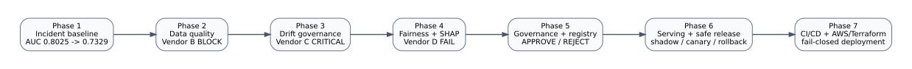
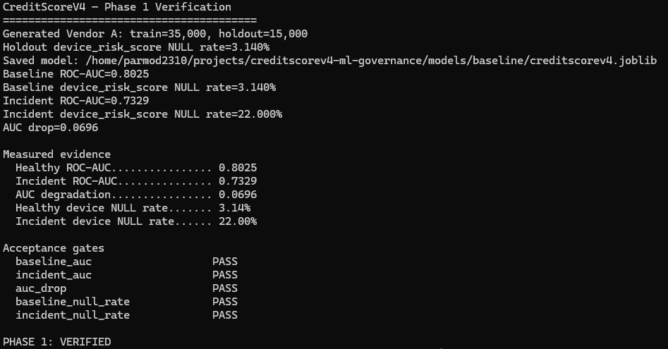
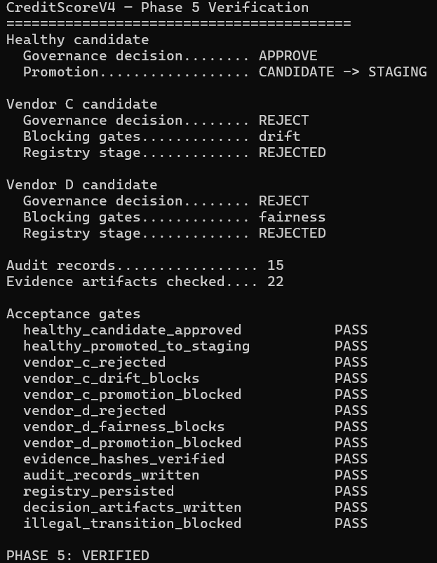
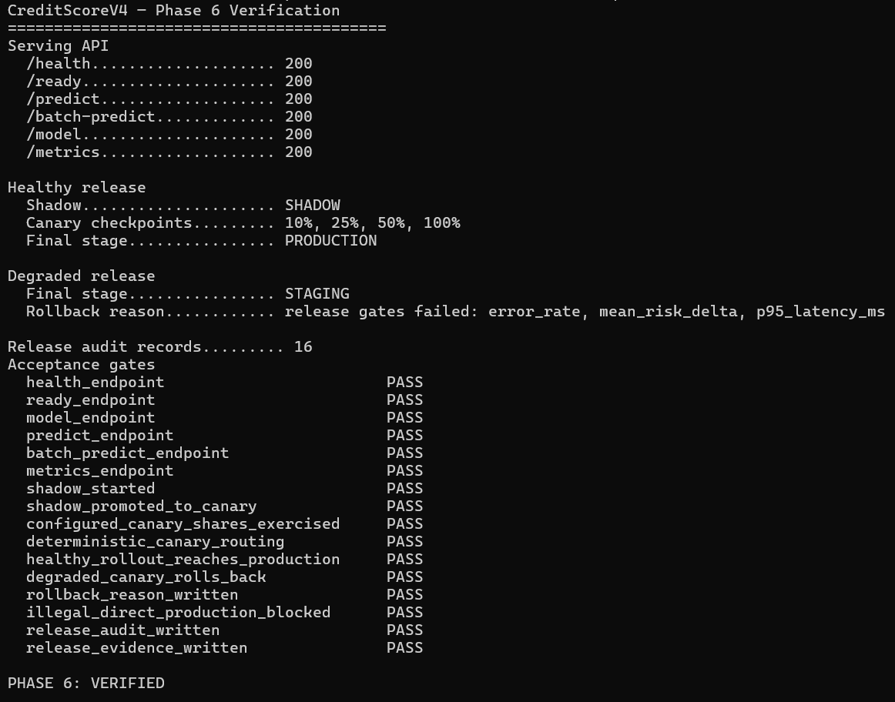
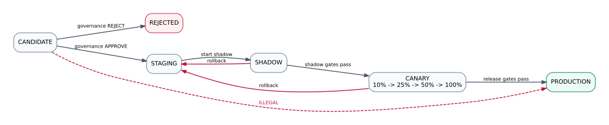

# CreditScoreV4 ML Governance

> Production-style synthetic ML governance case study for credit-risk incident remediation, drift/fairness controls, safe model release, and gated AWS deployment.

CreditScoreV4 ML Governance demonstrates how an ML team can move from a reproducible production-style incident to evidence-backed governance and controlled release engineering. The repository intentionally uses synthetic data and simulated failure modes so the full lifecycle can be tested deterministically without claiming a real banking incident or regulatory compliance.

## The 60-second story

A healthy credit-risk model starts with **ROC-AUC 0.8025** and a **3.14%** null rate in `device_risk_score`. Three controlled upstream scenarios are then introduced:

- **Vendor B — data-quality failure:** `device_risk_score` nulls jump to **22.00%**, model AUC falls to **0.7329**, and the Phase 2 quality gate blocks the batch.
- **Vendor C — contract-valid drift:** data quality still passes, but statistical monitoring detects **CRITICAL** feature and prediction drift (`PSI=0.2379`, `KS=0.1863`).
- **Vendor D — subgroup/fairness stress:** aggregate drift remains **STABLE**, yet fairness governance fails (`DP ratio=0.7480`, `selection-rate difference=0.1860`, `equalized-odds difference=0.2269`).

The project then converts those signals into deterministic governance decisions, records evidence and audit trails, serves the approved model through FastAPI, exercises shadow/canary/rollback release states, and validates a fail-closed AWS ECS/Fargate deployment path through GitHub Actions and Terraform.



## Why this project exists

Many ML portfolios stop at training accuracy. This project focuses on what happens **after** a model is trained:

1. What if upstream data silently changes?
2. What if the schema remains valid but distributions shift?
3. What if aggregate health looks stable while subgroup outcomes degrade?
4. What evidence should be required before promotion?
5. How should a release roll forward gradually and roll back automatically?
6. How do CI/CD and infrastructure controls fail closed instead of silently deploying?

The result is a single case study that connects model risk, software engineering, release safety, and cloud delivery.

<!-- PHASE8_REVIEWER_PATHS -->
## Reviewer paths

This repository supports different review depths without requiring every reader
to traverse the full implementation.

| Reader | Recommended path |
|---|---|
| Recruiter / hiring manager | README -> architecture -> evidence snapshots -> case study |
| Senior ML / MLOps engineer | architecture -> technical deep dive -> governance policy -> source/tests -> reproducible demo |
| ML governance / model-risk reviewer | model card -> validation report -> governance policy -> monitoring plan -> evidence index -> limitations |

Key Phase 8 documentation:

- [`docs/GOVERNANCE_POLICY.md`](docs/GOVERNANCE_POLICY.md)
- [`docs/MODEL_CARD.md`](docs/MODEL_CARD.md)
- [`docs/MODEL_VALIDATION_REPORT.md`](docs/MODEL_VALIDATION_REPORT.md)
- [`docs/MONITORING_PLAN.md`](docs/MONITORING_PLAN.md)
- [`docs/EVIDENCE_INDEX.md`](docs/EVIDENCE_INDEX.md)
- [`docs/TECHNICAL_DEEP_DIVE.md`](docs/TECHNICAL_DEEP_DIVE.md)
- [`docs/REPRODUCIBLE_DEMO.md`](docs/REPRODUCIBLE_DEMO.md)
- [`docs/LIMITATIONS.md`](docs/LIMITATIONS.md)

Phase 8 adds reviewer/evidence verification; it does not introduce a new model,
registry platform, orchestrator, or cloud runtime.

## Phase-by-phase lifecycle

| Phase | Engineering question | Demonstrated outcome |
|---|---|---|
| **1 — Incident baseline** | Can the failure be reproduced deterministically? | Baseline AUC **0.8025** → incident AUC **0.7329**; null rate **3.14% → 22.00%** |
| **2 — Data quality** | Can malformed or materially degraded vendor data be blocked before use? | Healthy Vendor A **PASS**; Vendor B **BLOCK** and quarantine evidence |
| **3 — Drift governance** | Can contract-valid distribution shift be detected? | Vendor C passes Phase 2 but reaches **CRITICAL** drift |
| **4 — Fairness + SHAP** | Can subgroup risk be detected even when aggregate drift is stable? | Vendor D aggregate drift **STABLE**, fairness governance **FAIL**; SHAP explains stressed proxy features |
| **5 — Governance + registry** | Can evidence become deterministic promotion decisions? | Healthy candidate **APPROVE → STAGING**; drift/fairness candidates **REJECTED** |
| **6 — Serving + safe release** | Can an approved candidate be served and rolled out safely? | FastAPI endpoints verified; shadow → canary **10/25/50/100%** → production; degraded canary rolls back |
| **7 — Automated delivery** | Can release engineering be automated without unsafe default cloud mutation? | CI/security/container/Terraform controls verified; AWS deployment remains **disabled by default** |
| **8 — Governance evidence** | Can reviewer-facing claims remain synchronized with executable policy, release controls, and generated evidence? | Evidence contract, model card, validation report, monitoring plan, limitations, reviewer manifest, and reproducible review path verified |

## Evidence snapshots

### 1. Incident reproduction



### 2. Governance decisions



### 3. Safe release and rollback



## Governance architecture

The governance layer treats promotion as an **evidence decision**, not a deployment shortcut.

```text
Data-quality evidence ─┐
Drift evidence ────────┤
Performance evidence ──┤
Calibration evidence ──┼──> Policy / blocking gates ──> APPROVE or REJECT
Fairness evidence ─────┤                              │
Evidence hashes ───────┘                              ├──> Registry transition
                                                      ├──> Audit record
                                                      └──> Decision artifact
```

Phase 5 uses a project-owned registry/state machine rather than claiming MLflow integration. MLflow is a reasonable future backend, but it is not required to demonstrate the governance contract implemented here.

## Release lifecycle



The safe path is explicit:

```text
CANDIDATE -> STAGING -> SHADOW -> CANARY -> PRODUCTION
                       |          |
                       +----------+----> STAGING (rollback)
```

Direct `CANDIDATE -> PRODUCTION` promotion is blocked. Canary routing is deterministic, configured shares are exercised, and failed release gates return the candidate to staging with an evidence-backed rollback reason.

## Serving API

Phase 6 exposes a FastAPI service with:

```text
GET  /health
GET  /ready
POST /predict
POST /batch-predict
GET  /model
GET  /metrics
```

The verification suite checks each endpoint, model readiness, Prometheus-compatible metrics, release transitions, and rollback behavior.

## Automated delivery and infrastructure

Phase 7 adds the production-style delivery path:

```text
Pull request
   |
   +--> Python quality + cumulative verification
   +--> Gitleaks
   +--> Trivy IaC scan
   +--> Docker image build + smoke test
   +--> Terraform fmt + validate
   |
   `--> explicit deployment gate
          |
          `--> GitHub OIDC -> AWS -> immutable ECR -> ECS/Fargate -> HTTPS ALB
```

Important: the repository validates the AWS deployment architecture, but cloud mutation is **fail-closed by default** with `AWS_DEPLOY_ENABLED=false`. Actual AWS deployment requires explicit opt-in plus OIDC, Terraform state, confirmation, and ACM certificate configuration.

## Verification status

The v0.8.0 code line is verified at the following boundaries:

| Verification | Result |
|---|---:|
| Ruff / Black / mypy / compile checks | **PASS** |
| Phase 1–7 regression suite | **63 passed** |
| Phase 8 evidence-contract tests | **6 passed** |
| Phase 1–8 tests exercised by `make phase8-verify` | **69 passed** |
| Terraform format / validation | **PASS** |
| Container smoke test | **PASS** |
| Gitleaks | **PASS** |
| Trivy | **PASS** |
| Phase 8 implementation PR #9 checks | **5/5 successful** |

Current code version: **v0.8.0**. Published tags are recorded in GitHub Releases.

## Quick verification

```bash
python -m venv .venv
source .venv/bin/activate
python -m pip install -e ".[dev]"

make quality
make phase8-verify
make phase7-terraform
python -m pytest -q
```

For focused evidence:

```bash
python scripts/verify_phase1.py
python scripts/verify_phase2.py
python scripts/verify_phase3.py
python scripts/verify_phase4.py
python scripts/verify_phase5.py
python scripts/verify_phase6.py
python scripts/verify_phase7.py
python scripts/verify_phase8.py
```

## Documentation

- [`docs/CASE_STUDY.md`](docs/CASE_STUDY.md) — complete engineering case study
- [`docs/ARCHITECTURE_FIGURES.md`](docs/ARCHITECTURE_FIGURES.md) — Phase 1–7 diagram index
- [`docs/RELEASE_STATE.md`](docs/RELEASE_STATE.md) — registry and rollout state model

## Design principles

- **Reproducibility before remediation** — every governance control starts from deterministic failure evidence.
- **Separate data validity from distribution stability** — a valid schema does not mean healthy data.
- **Separate aggregate health from subgroup health** — stable averages can hide fairness failures.
- **Evidence before promotion** — decisions are policy-driven, auditable, and hash-verifiable.
- **Progressive delivery instead of instant production** — approved models still pass shadow/canary release gates.
- **Fail closed** — cloud deployment is opt-in rather than implicit.

## Scope and limitations

This is a **production-style synthetic case study**. It does not represent a real bank incident, a live lending decision system, or a claim of regulatory compliance. Protected attributes are used for evaluation/governance scenarios and are intentionally excluded from model features. The Terraform architecture is validated and security-scanned; the repository does not claim that the current release has been applied to a live AWS production account.

## What I would build next

The next upgrades would focus on replacing local/simplified control-plane components with managed production backends rather than adding more demo features: MLflow or another registry backend, workflow orchestration such as Airflow, durable audit/evidence storage, signed images/SBOM provenance, OpenTelemetry/SLOs, load tests, and a real gated cloud environment with cost controls.

---

**Current code version:** `v0.8.0`
**Primary focus:** ML governance · model risk · safe release engineering · MLOps · AWS/Terraform
