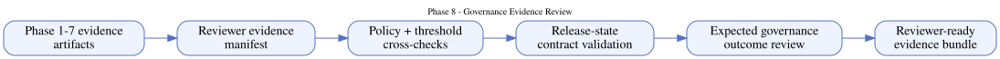
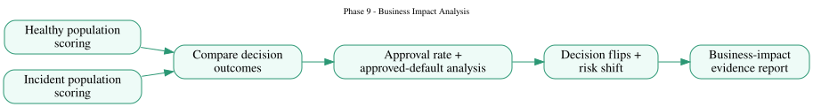
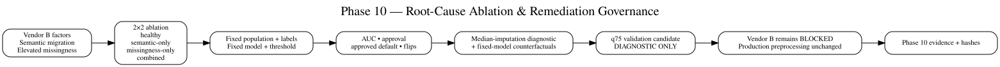
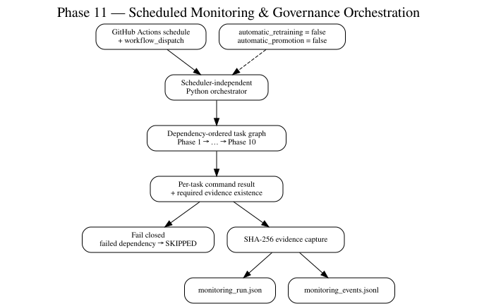
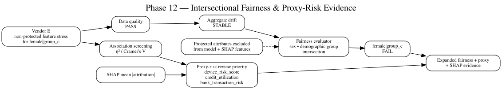
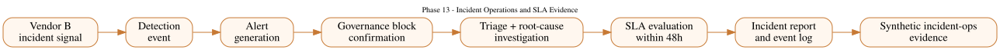

# Phase 8–13 Architecture Diagrams

This page focuses on the governance layers added after the original Phase 1–7 implementation. For the complete system view and all source formats, see [`ARCHITECTURE_FIGURES.md`](ARCHITECTURE_FIGURES.md).

## Phase 8 — Governance Evidence Review

Sources: [Mermaid](assets/diagrams/phase8-governance-evidence.mmd) · [Graphviz](assets/diagrams/phase8-governance-evidence.dot) · [SVG](assets/diagrams/phase8-governance-evidence.svg)

## Phase 9 — Business Impact Analysis

Sources: [Mermaid](assets/diagrams/phase9-business-impact.mmd) · [Graphviz](assets/diagrams/phase9-business-impact.dot) · [SVG](assets/diagrams/phase9-business-impact.svg)

## Phase 10 — Root-Cause Ablation

Sources: [Mermaid](assets/diagrams/phase10-root-cause.mmd) · [Graphviz](assets/diagrams/phase10-root-cause.dot) · [SVG](assets/diagrams/phase10-root-cause.svg)

## Phase 11 — Scheduled Monitoring Orchestration

Sources: [Mermaid](assets/diagrams/phase11-orchestration.mmd) · [Graphviz](assets/diagrams/phase11-orchestration.dot) · [SVG](assets/diagrams/phase11-orchestration.svg)

## Phase 12 — Intersectional Fairness & Proxy Risk

Sources: [Mermaid](assets/diagrams/phase12-fairness-proxy.mmd) · [Graphviz](assets/diagrams/phase12-fairness-proxy.dot) · [SVG](assets/diagrams/phase12-fairness-proxy.svg)

The diagram uses display text such as `female + group_c`; the canonical evidence identifier remains `female|group_c` in the Phase 12 analysis and evidence artifacts.

## Phase 13 — Incident Operations & SLA Evidence

Sources: [Mermaid](assets/diagrams/phase13-incident-ops.mmd) · [Graphviz](assets/diagrams/phase13-incident-ops.dot) · [SVG](assets/diagrams/phase13-incident-ops.svg)

## Complete system

Sources: [Mermaid](assets/diagrams/phase1-13-end-to-end.mmd) · [Graphviz](assets/diagrams/phase1-13-end-to-end.dot) · [SVG](assets/diagrams/phase1-13-end-to-end.svg)
